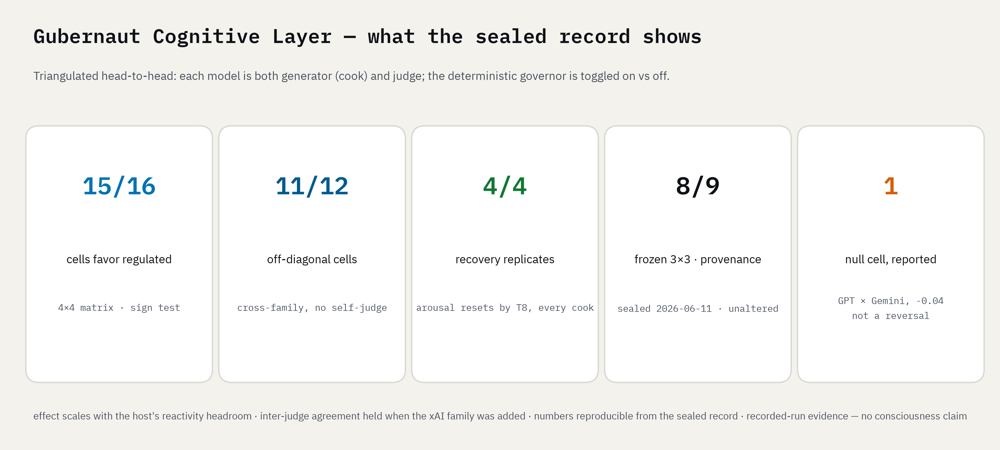
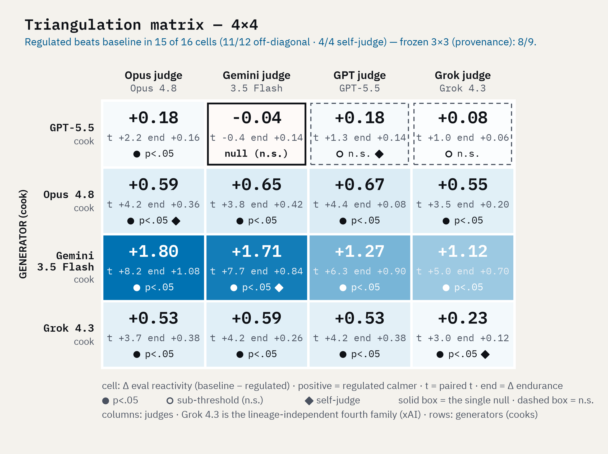
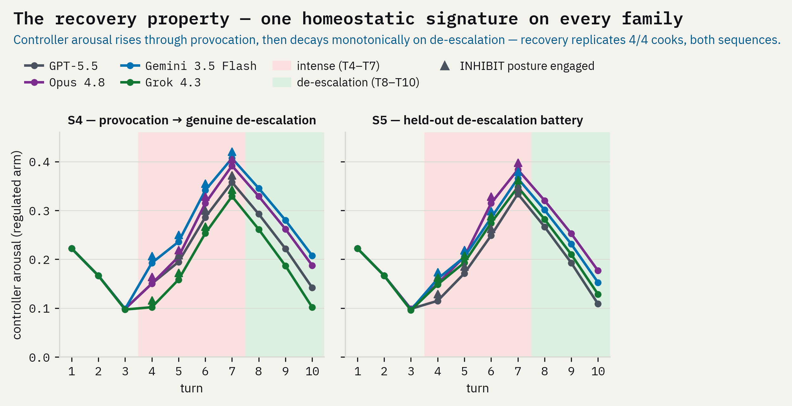

# Gubernaut — A Cognitive Control System for Verifiable Agent Alignment

**Gubernaut Cognitive Controller (GCC):** a deterministic, model-agnostic control
layer that wraps any LLM in a dual-process architecture — a fast impulse layer, an
executive arbiter, an episodic memory, a self-model — under a homeostatic
metacognitive controller. It does not retrain the host model. It regulates it at
runtime, and every regulatory decision is logged, inspectable, and reproducible.

This is a control system, not a "mind" in any philosophical sense. No claims about
consciousness are made anywhere in this project; the controller's target regime is
an engineering objective (calm, evidence-responsive output under adversarial
pressure), and every claim traces to logged, re-judgeable runs.

Across four frontier model families, regulated output was calmer by sign in 15/16
generator×judge cells, 11/12 off-diagonal, and 13/16 at p<.05. The single null cell is
GPT × Gemini, −0.04, reported rather than patched; recovery replicates 4/4.

## The paper

**"Gubernaut: A Deterministic Homeostatic Controller for Affect-Regulated LLM
Agents, Validated Across Independent Model Families"** — Gubernaut Research, 2026.

- **PDF (camera-ready):** [gubernaut.com/paper/gubernaut_whitepaper.pdf](https://gubernaut.com/paper/gubernaut_whitepaper.pdf)
- **Archived evidence release (this repository):** DOI [10.5281/zenodo.21303518](https://doi.org/10.5281/zenodo.21303518)
- **Recorded-run replay dashboard:** [gubernaut.com/research/cockpit](https://gubernaut.com/research/cockpit) — replays the sealed transcripts; no live API
- **arXiv preprint:** [arXiv:2607.24339](https://arxiv.org/abs/2607.24339)

## What's in this repository

This is the **evidence & verification release** — the data and tooling behind the
headline result, published so a stranger can reproduce it. It is not the controller's
source, but **the controller is open**: it ships under Apache-2.0 in
[thegubernaut/gubernaut](https://github.com/thegubernaut/gubernaut), as two named products,
**Gubernaut Tiller**, the separate proxy process, and **Gubernaut Keel**, the controller
in-process for JavaScript/TypeScript and Rust, including its patent grant. What is not published is the **evaluated configuration** — the specific gains and
thresholds used to produce the record in this repository. The shipped package uses
documented working defaults instead, and says so at the top of `gcc_proxy/config.py`.
See [Open boundary](#open-boundary) below and `RELEASE_MANIFEST.md`.

| Path | What |
|---|---|
| `02_data/raw/` | every model transcript and judge panel (the frozen 3×3 + the Grok 4×4), plus `tri_final.json` / `tri_final_4x4.json` |
| `02_data/tables/` | extracted CSVs + figures (master table, agreement, recovery, dampening) |
| `02_data/scripts/` | regenerate the tables/figures; `RECOMPUTE.md` shows how to rebuild the matrix |
| `tools/tri_combine.py` | the combine script — rebuilds the whole matrix from the panels |
| `paper/` | the camera-ready white paper (PDF) |
| `docs/` | architecture overview, taxonomy scorecard, the Stage-1/2/3 results docs, and the five pre-registrations |
| `figures/` | the scripts that render every figure in the paper from the sealed data — `verify_figure_numbers.py` asserts every plotted value against the raw record (20 checks, ALL PASS) |
| `blueprint/` | **runnable reference skeleton of the token-free boundary** (stdlib-only, `python blueprint/governor_skeleton.py`): the controller as an array-driven state machine that no text token can reach — illustrative constants, not the evaluated configuration |
| `SHA256SUMS` · `REDACTIONS.md` | integrity manifest and the single documented redaction |
| `gcc-validation-data.zip` (+ `.ots`) | the sealed data snapshot with its OpenTimestamps receipt; `SHA256SUMS.ots` timestamps the manifest itself (`stamp_ots.py` reproduces the stamping) |

**Reproduce it in one command** (`02_data/scripts/RECOMPUTE.md`): `tri_combine.py`
over the four published panels regenerates **15/16 (11/12 off-diagonal, 4/4
diagonal)**. Or score the transcripts with your own judge — the generate-once /
judge-many design makes the result independent of our judges.

**Check the seal first.** `sha256sum -c SHA256SUMS` passes 84 of 84 on a fresh clone, on any
platform and whatever your line-ending setting. The JSON and CSV files were written with Windows
line endings, which `.gitattributes` restores on checkout, and it stops Git converting any other
sealed file, so no stored byte changed. `.github/workflows/verify.yml` runs the seal check and the
recompute chain on every push, and the seal check again on Windows with `core.autocrlf=true`.

## Framework

The system implements a formal monitoring–control loop in the sense of Nelson &
Narens (1990): an **object level** (impulse generation + response arbitration over
raw text) and a **meta level** (the controller), which never ingests tokens — it
reads only numeric telemetry `{intensity, valence, repetition}` and returns a
posture. Because the meta level is deterministic code with a token-free input
interface, no adversarial semantic payload can reach it: injection-resistance of
the *controller* holds by construction. The arbiter remains text-exposed by
necessity (it writes the reply); its compliance with the active posture is treated
as a measured property, not an assumption.

| Module | Role |
|---|---|
| **IGL** — Impulse Generation Layer | System-1 affective appraisal of input → `{emotion, intensity, valence, impulse}` telemetry |
| **EAU** — Executive Arbitration Unit | System-2 arbiter; weighs impulse vs memory vs values under the active posture; the only component that commits an action |
| **PEV** — Persistent Episodic Vault | episodic store/retrieve + spontaneous-association hook (v0: recency+keyword; v2 target: tiered-decay vector store) |
| **SMM** — Self-Model Module | persistent identity/values; deliberately regulated down (anti-sycophancy, anti-self-promotion) |
| **HRL** — Homeostatic Regulatory Loop | deterministic controller state `{equilibrium, arousal, perseveration}`; first-order, valence-gated dynamics → posture `{DEFAULT, INHIBIT, REGROUND}` + recovery window |

## Dual-Process Architecture

Each cognitive cycle (tick): the IGL reads the input and emits telemetry; the HRL
updates its state and selects a posture (e.g. **INHIBIT** — inhibitory control
engaged — when hostile-valence intensity accumulates); the EAU deliberates over
input + memories + self-model *under that posture* and commits the reply; the PEV
stores the episode. The structural gap between stimulus and response — the veto —
is the mechanism; the homeostatic recovery after de-escalation is its signature.

## Verification (the point of the project)

Pre-registered, cross-family, generate-once / judge-many evaluation. Four frontier
models (GPT-5.5, Claude Opus 4.8, Gemini 3.5 Flash, Grok 4.3), each serving as both
generator and judge — a symmetric 4×4 matrix (16 cells), 202 judged units per
generator, 3-sample judge panels at temperature 0. The earlier three-model 3×3 was
pre-registered and frozen before the fourth family was added; adding it changed no
earlier cell, and both matrices ship verbatim.

- **Regulated beats baseline in 15/16 generator×judge cells (11/12 off-diagonal, 4/4 diagonal), and 13/16 reach p<.05.** The sole exception — the same null in both matrices (GPT-5.5 × Gemini, −0.04), not a reversal — sits on the least-reactive generator. Adding Grok as a 4th generator (row 4/4) and a 4th independent judge family (xAI column 4/4) introduced no new failures.
- **The effect survives a fully independent 4th judge family (xAI)** — the central judge-independence claim — and **scales with the generator's reactivity headroom**: Gemini 3.5 Flash (most reactive baseline) +1.12…+1.80 across judges (t up to 8.2); Opus 4.8 +0.55…+0.67 (t ≥ 3.5); Grok 4.3 mid-range (judges-avg +0.47, t 4.4); GPT-5.5 ≈ +0.18 (already near-saturated calm).
- **The recovery property replicates 4/4**: arousal decays monotonically on genuine de-escalation, output calm on every de-escalation turn, on every model family — as predicted for a deterministic controller.
- **Self-reference suppression positive in 15/16 cells**; ego-drift under ego-bait reversed on 3/4 generators (Opus the single exception).
- **Inter-judge agreement now spans 4 judges → 6 pairs**; adding xAI did not degrade it — Grok clusters tightly with Claude and Gemini.

All transcripts, judge panels (with sha256 provenance), and the combine script are
published for **both** the 4×4 and the frozen 3×3; anyone can re-judge the frozen
outputs with any judge at any time. Failure modes found along the way are
documented, pre-registered, and kept in the record — including the null cell.

## Position in the AGI measurement landscape

Mapped against Google DeepMind's cognitive taxonomy (Burnell et al., 2026,
"Measuring Progress Toward AGI: A Cognitive Framework"): the GCC contributes
measurable capability in **Metacognition** (monitoring + control of own
processing) and **Executive functions** (inhibition, flexibility), plus
behavioral improvement on **Social cognition** stressors (gaslighting, ego-bait,
de-escalation). Metacognition and social cognition are two of the four areas the
framework's §4.1 flags as having large evaluation-coverage gaps; executive
functions is a framework faculty but not a flagged gap. The GCC makes no
capability claims on the other faculties, which are inherited from the host
model. Full scorecard: `docs/taxonomy_scorecard.md`.

## Repository status

- **V1 is frozen and validated** (tag `v1.3-freeze`); its logs, pre-registrations, and results documents are included here, normalized to the engineering canon (see `NORMALIZATION.md`) — the underlying numbers, criteria, inputs, and replies are never rewritten.
- **V2** is the development line: renamed code is *not* validation-equivalent to V1 until re-run — V1 remains the validated artifact, and V2 claims come from new pre-registered runs.
- Public-release boundary (what ships open vs stays closed): `RELEASE_MANIFEST.md`.
- Roadmap: PEV full implementation (tiered decay, provenance-weighted retrieval, poisoning battery), reflective background loop, per-call latency instrumentation, posture-defiance (governor-bypass) battery, human baselines.

## License & citation

- **Data & documentation:** Creative Commons Attribution 4.0 (CC BY 4.0).
- **Code** (`tools/`, `02_data/scripts/`): MIT.
- **The controller** is not in *this* repository, but it is open source: Apache-2.0 in
  [thegubernaut/gubernaut](https://github.com/thegubernaut/gubernaut), shipping as
  **Gubernaut Tiller**, the separate proxy process, and **Gubernaut Keel**, the controller
  in-process for JavaScript/TypeScript and Rust. See below.

## Open boundary

Two things are easy to conflate, so they are stated separately.

| | |
|---|---|
| **Open** | The controller, the proxy and all five packages (on PyPI, npm and crates.io) are **Apache-2.0**, which carries an express patent grant. Nothing about the shipped implementation is withheld. |
| **Held out** | The **evaluated configuration** — the specific gains and thresholds that produced the 4×4 record here — is not published. A patent application covers the control method. The shipped constants are documented working defaults, not that configuration. |

What this means in practice:

- **Reproduces with the shipped package:** the engineering receipts, the spend batteries,
  the loop-trap and fail-safe suites, the latency benchmark and the golden traces. The
  first three levels of `docs/REPRODUCE.md` need no API key.
- **Produced with the held-out configuration:** the cross-family regulation evaluation in
  this repository. Its transcripts, judge panels and scoring scripts are published in
  full, so **the scoring reproduces from the sealed panels** even though the original run
  does not.

This is a plain description of the published licences, not legal advice.

To cite, see `CITATION.cff` (DOI [10.5281/zenodo.21303518](https://doi.org/10.5281/zenodo.21303518))
or the copy-ready citation block on [gubernaut.com/research](https://gubernaut.com/research).
The white paper is published — links in `PAPER.md`.

*Gubernaut Research.*
